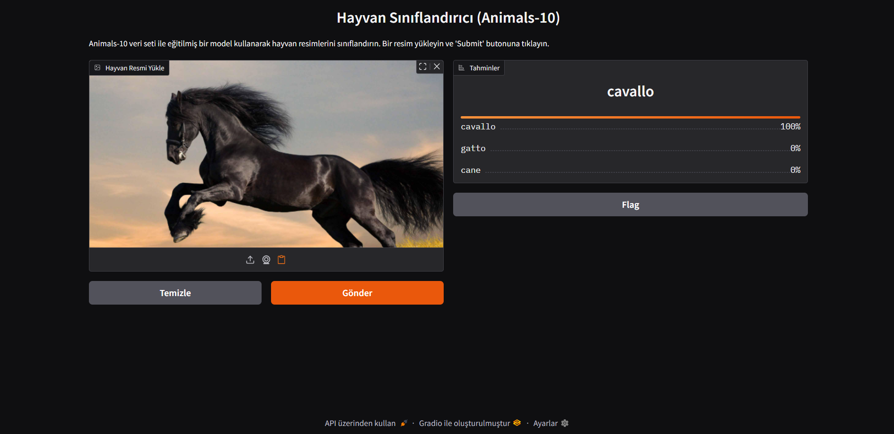
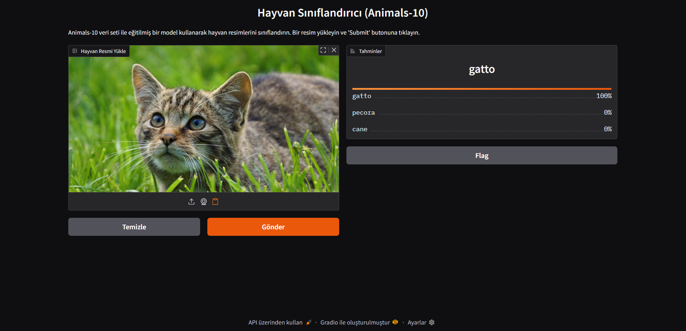

# animals-ai-classification

Bu proje, Animals-10 veri seti ile eğitilmiş bir PyTorch modeli kullanarak hayvan resimlerini sınıflandıran basit bir web uygulamasıdır. Arayüz Gradio ile oluşturulmuştur.

## Özellikler

-   Resim yükleyerek hayvan türü tahmini alma.
-   10 farklı hayvan sınıfını tanıma (köpek, kedi, at, vb.).
-   Kullanıcı dostu web arayüzü.

## Kullanılan Teknolojiler

-   Python 3.x
-   PyTorch
-   Gradio
-   Pillow, NumPy, scikit-learn, Matplotlib

## Veri Seti

-   [Animals-10 Dataset (Kaggle)](https://www.kaggle.com/datasets/alessiocorrado99/animals10)

## Kurulum

1.  **Depoyu Klonlayın:**
    ```bash
    git clone https://github.com/[emrebayhan]/[animals-ai-classification].git
    cd [animals-ai-classification]
    ```
2.  **Gerekli Kütüphaneleri Yükleyin:**
    Proje için gerekli temel kütüphaneleri yükleyin:
    ```bash
    pip install -r requirements.txt
    ```
## Kullanım:
Aşağıdaki komut ile Gradio arayüzünü aktifleştirebilirsiniz.
```bash
    python.exe app.py
 ```

## Ekran Görüntüleri


