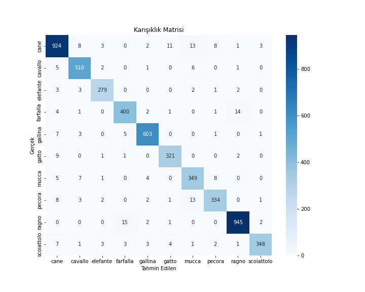

# animals-ai-classification

Bu proje, Animals-10 veri seti ile eğitilmiş bir PyTorch modeli kullanarak hayvan resimlerini sınıflandıran basit bir web uygulamasıdır. Arayüz Gradio ile oluşturulmuştur.

## Özellikler

-   Resim yükleyerek hayvan türü tahmini alma.
-   10 farklı hayvan sınıfını tanıma (köpek, kedi, at, vb.).
-   Kullanıcı dostu web arayüzü.
-   Model değerlendirme ve görselleştirme desteği.

## Kullanılan Teknolojiler

-   Python 3.x  
-   PyTorch  
-   Gradio  
-   Pillow, NumPy, scikit-learn, Matplotlib  

## Veri Seti

-   [Animals-10 Dataset (Kaggle)](https://www.kaggle.com/datasets/alessiocorrado99/animals10)

## Kurulum

1.  **Depoyu Klonlayın:**
    ```bash
    git clone https://github.com/emrebayhan/animals-ai-classification.git
    cd animals-ai-classification
    ```

2.  **Gerekli Kütüphaneleri Yükleyin:**
    Proje için gerekli temel kütüphaneleri yükleyin:
    ```bash
    pip install -r requirements.txt
    ```

## Kullanım:
Aşağıdaki komut ile Gradio arayüzünü aktifleştirebilirsiniz.
```bash
python app.py
```

## Ekran Görüntüleri:
Gradio ile oluşturulan web arayüzü üzerinden resim yükleyip hayvan sınıflandırması yapılabilir:


## Proje Yapısı ve Açıklamalar

-  **data_loader.py** : Verilerin yüklenmesi ve eğitim/validasyon için **train:val = 80:20** oranında ayrılması sağlanır.
-  **train.py** : Modelin eğitim süreci bu dosyada tanımlanır.
-  **evaluate.py** : Eğitilen modelin test verisi üzerindeki doğruluğu, precision, recall, F1 gibi metriklerle değerlendirilmesini sağlar.
-  **model.py** : PyTorch ile tanımlanmış sinir ağı modelini içerir.
-  **animals10_best_model.pth / animals10_final_model.pth** : Eğitilmiş modellerin kaydedilmiş halleri.
-  **app.py** : Gradio ile kullanıcı arayüzünün oluşturulduğu ve modeli kullanan uygulama.
-  **confusion_matrix.png** : Modelin sınıflandırma başarımını görselleştiren karmaşıklık matrisi.
-  **training_history.png** : Modelin eğitim süresince doğruluk ve kayıp değerlerinin nasıl değiştiğini gösteren grafik.

## Sınıf İsimleri:
- **cane** : köpek
- **cavallo** : at
- **elefante** : fil
- **farfalla** : kelebek
- **gallina** : tavuk
- **gatto** : kedi
- **mucca** : inek
- **pecora** : koyun
- **ragno** : örümcek
- **scoiattolo** : sincap

## Model Performansı

-  **Eğitim Süreci** : Aşağıdaki grafikte, modelin eğitim sürecindeki doğruluk (accuracy) ve kayıp (loss) değerlerinin zamana göre değişimi görülmektedir:


-  **Karmaşıklık Matrisi** : Modelin hangi sınıflarda ne kadar doğru ve yanlış tahmin yaptığını gösteren karmaşıklık matrisi:

